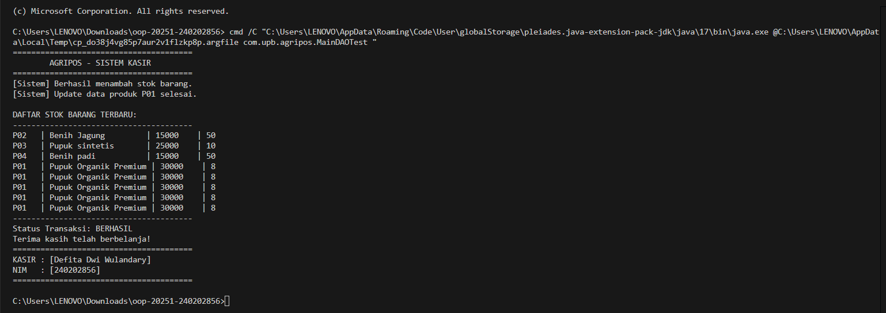

---

# 📘 **Laporan Praktikum Minggu 11**

**Topik:** *Data Access Object (DAO) dan CRUD Database dengan JDBC pada Agri-POS*

---

## 🧑‍🎓 Identitas

| Data      | Keterangan           |
| --------- | -------------------- |
| **Nama**  | Defita Dwi Wulandary |
| **NIM**   | 240202856            |
| **Kelas** | 3 IKRA               |

---

## 🎯 Tujuan

Mahasiswa mampu:

1. Memahami konsep **Data Access Object (DAO)** dalam pemrograman berorientasi objek.
2. Menghubungkan aplikasi Java dengan **database PostgreSQL** menggunakan **JDBC**.
3. Mengimplementasikan operasi **CRUD (Create, Read, Update, Delete)** secara lengkap.
4. Mengintegrasikan DAO dengan class aplikasi Agri-POS sesuai prinsip desain yang baik. 

---

## 📚 Dasar Teori

### 1. Data Access Object (DAO)

DAO adalah pola desain yang memisahkan **logika akses data** dari **logika bisnis** aplikasi.
Dengan DAO, perubahan database tidak memengaruhi kode utama aplikasi sehingga sistem lebih mudah dipelihara. 

### 2. JDBC

JDBC (Java Database Connectivity) digunakan untuk menghubungkan Java dengan database relasional.
Komponen penting JDBC:

* `DriverManager`
* `Connection`
* `PreparedStatement`
* `ResultSet` 

---

## 🗄️ Spesifikasi Database

Database: **PostgreSQL**
Nama database: `agripos`

Struktur tabel:

```sql
CREATE TABLE products (
    code VARCHAR(10) PRIMARY KEY,
    name VARCHAR(100),
    price DOUBLE PRECISION,
    stock INT
);
```


---

## 🧩 Implementasi

### 1. Model – Product

```java
package com.upb.agripos.model;

public class Product {
    private String code;
    private String name;
    private double price;
    private int stock;

    public Product(String code, String name, double price, int stock) {
        this.code = code;
        this.name = name;
        this.price = price;
        this.stock = stock;
    }

    // Getter
    public String getCode() { return code; }
    public String getName() { return name; }
    public double getPrice() { return price; }
    public int getStock() { return stock; }

    // Setter
    public void setName(String name) { this.name = name; }
    public void setPrice(double price) { this.price = price; }
    public void setStock(int stock) { this.stock = stock; }
}
```


---

### 2. MAIN DAO TEST

```java
package com.upb.agripos;

import java.sql.Connection;
import java.sql.DriverManager;
import com.upb.agripos.dao.ProductDAO;
import com.upb.agripos.dao.ProductDAOImpl;
import com.upb.agripos.model.Product;
import java.util.List;

public class MainDAOTest {
    public static void main(String[] args) throws Exception {
        // Konfigurasi koneksi database
        String url = "jdbc:postgresql://localhost:5432/agripos";
        String user = "postgres";
        String pass = "defita"; // Ganti dengan password database Anda

        try (Connection conn = DriverManager.getConnection(url, user, pass)) {
            ProductDAO dao = new ProductDAOImpl(conn);

            System.out.println("=======================================");
            System.out.println("        AGRIPOS - SISTEM KASIR         ");
            System.out.println("=======================================");

            // 1. Operasi Insert (Create)
            dao.insert(new Product("P03", "Pupuk sintetis", 25000, 10));
            dao.insert(new Product("P04", "Benih padi", 15000, 50));
            System.out.println("[Sistem] Berhasil menambah stok barang.");

            // 2. Operasi Update
            dao.update(new Product("P01", "Pupuk Organik Premium", 30000, 8));
            System.out.println("[Sistem] Update data produk P01 selesai.");

            // 3. Menampilkan Daftar Barang (Read)
            System.out.println("\nDAFTAR STOK BARANG TERBARU:");
            System.out.println("---------------------------------------");
            List<Product> products = dao.findAll();
            for (Product p : products) {
                System.out.printf("%-5s | %-20s | %-8.0f | %-3d\n", 
                    p.getCode(), p.getName(), p.getPrice(), p.getStock());
            }

            // Bagian Bawah Struk (Identitas Kasir)
            System.out.println("---------------------------------------");
            System.out.println("Status Transaksi: BERHASIL");
            System.out.println("Terima kasih telah berbelanja!");
            System.out.println("=======================================");
            System.out.println("KASIR : [Defita Dwi Wulandary]"); // Ganti dengan Nama Anda
            System.out.println("NIM   : [240202856]");  // Ganti dengan NIM Anda
            System.out.println("=======================================");

            // Opsional: Hapus data setelah tes (agar database bersih)
            // dao.delete("P01");
            // dao.delete("P02");
        }
    }
}
```


## ▶️ Hasil Eksekusi

> 📌 Lampirkan screenshot hasil CRUD  yang menunjukkan:
>
> * Insert
> * Update
> * Read
> * Delete berhasil dijalankan.

---

## 🔍 Analisis

Dengan pola **DAO**, sistem Agri-POS tidak bergantung langsung pada SQL di `main()`.
Semua operasi database diatur melalui `ProductDAO`, sehingga:

* Kode lebih rapi
* Mudah diuji
* Mudah diganti jika database berubah

Penggunaan **PreparedStatement** juga meningkatkan keamanan dari SQL Injection.

---

## 🧾 Kesimpulan

Penerapan **DAO dan JDBC** membuat Agri-POS lebih profesional karena:

* Data dan logika bisnis terpisah
* Operasi CRUD lebih terstruktur
* Sistem lebih mudah dikembangkan dan dipelihara

---

## 📊 Penilaian (RPS)

| Aspek                       |    Bobot |   |
| --------------------------- | -------: | - |
| Implementasi DAO sesuai OOP |      30% |   |
| CRUD berjalan lengkap       |      30% |   |
| Integrasi dengan aplikasi   |      20% |   |
| Laporan & dokumentasi       |      20% |   |
| **Total**                   | **100%** |   |

---