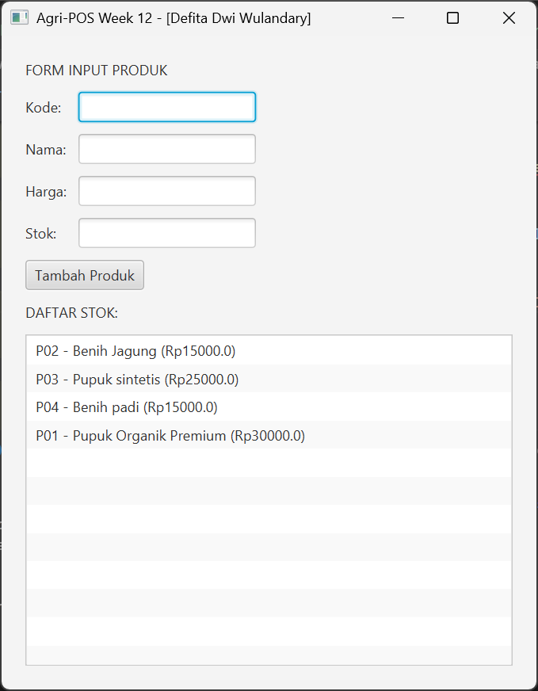

# Laporan Praktikum Minggu 12
Topik: [GUI Dasar JavaFX (Event-Driven Programming)]

## Identitas
- Nama  : [Defita Dwi Wulandary]
- NIM   : [240202856]
- Kelas : [3 IKRA]

---

## Tujuan
(Setelah mengikuti praktikum ini, mahasiswa mampu:
1. Menjelaskan konsep event-driven programming.
2. Membangun antarmuka grafis sederhana menggunakan JavaFX.
3. Membuat form input data produk.
4. Menampilkan daftar produk pada GUI.
5. Mengintegrasikan GUI dengan modul backend yang telah dibuat (DAO & Service).)

---

## Dasar Teori
(## Keterkaitan dengan Pertemuan Sebelumnya
Praktikum ini WAJIB menggunakan hasil dari:
- Pertemuan 7: Collections
- Pertemuan 10: MVC & Design Pattern
- Pertemuan 11: DAO + JDBC (CRUD PostgreSQL)

Mahasiswa TIDAK diperbolehkan membuat ulang logika CRUD di layer GUI. Gunakan `ProductService` yang memanggil `ProductDAO` di backend.

---

## Keterkaitan dengan Bab 6 (UML + SOLID)
Implementasi GUI pada Bab 12 harus merealisasikan artefak desain Bab 6:

1. **Use Case**
	- Minimal mencakup alur "Kelola Produk" (Tambah Produk dan Lihat Daftar Produk).
	- Nama use case/aktor pada laporan Bab 6 harus konsisten dengan fitur GUI.

2. **Activity Diagram**
	- Alur Tambah Produk di GUI mengikuti activity diagram (validasi input → panggil service → update tampilan).

3. **Sequence Diagram**
	- Untuk aksi tombol "Tambah Produk", urutan interaksi mengikuti sequence diagram: `View` → `Controller` → `Service` → `DAO` → `DB`, lalu kembali untuk memperbarui UI.

4. **Class Diagram & SOLID**
	- Struktur kelas mengikuti class diagram Bab 6 (entitas/model, controller, service, DAO).
	- Terapkan **DIP**: `View` tidak boleh memanggil `DAO` langsung; akses data harus melalui `Service` (dan/atau interface DAO bila sudah dirancang di Bab 6).
 
Jika Bab 6 Anda menggunakan nama kelas/metode berbeda, Bab 12 harus mengikuti nama tersebut (bukan membuat versi baru).

---)


## Kode Program
(

```java
//DatabaseConnection.java
package com.upb.agripos.config;

import java.sql.Connection;
import java.sql.DriverManager;

public class DatabaseConnection {

    private static final String URL =
        "jdbc:postgresql://localhost:5432/agripos";
    private static final String USER = "postgres";
    private static final String PASS = "071005";

    public static Connection getConnection() throws Exception {
        return DriverManager.getConnection(URL, USER, PASS);
    }
}
//ProductController.java
package com.upb.agripos.controller;

import com.upb.agripos.model.Product;
import com.upb.agripos.service.ProductService;
import javafx.collections.FXCollections;
import javafx.collections.ObservableList;

public class ProductController {
    private ProductService productService;

    public ProductController(ProductService productService) {
        this.productService = productService;
    }

    // Metode ini dipanggil saat tombol Tambah diklik
    public void addProduct(String code, String name, String priceStr, String stockStr) throws Exception {
        // Validasi format angka
        double price = Double.parseDouble(priceStr);
        int stock = Integer.parseInt(stockStr);
        
        Product p = new Product(code, name, price, stock);
        productService.insert(p); // Meneruskan ke Service
    }

    // Mengambil data untuk ditampilkan di ListView
    public ObservableList<String> getProductList() throws Exception {
        ObservableList<String> items = FXCollections.observableArrayList();
        for (Product p : productService.findAll()) {
            items.add(p.getCode() + " - " + p.getName() + " (Rp" + p.getPrice() + ")");
        }
        return items;
    }
}
//ProductDAO.java
package com.upb.agripos.dao;

import java.util.List;
import com.upb.agripos.model.Product;

public interface ProductDAO {
    void insert(Product product) throws Exception;
    Product findByCode(String code) throws Exception;
    List<Product> findAll() throws Exception;
    void update(Product product) throws Exception;
    void delete(String code) throws Exception;
}
//Product.java
package com.upb.agripos.model;

public class Product {
    private String code;
    private String name;
    private double price;
    private int stock;

    public Product(String code, String name, double price, int stock) {
        this.code = code;
        this.name = name;
        this.price = price;
        this.stock = stock;
    }

    // Getter
    public String getCode() { return code; }
    public String getName() { return name; }
    public double getPrice() { return price; }
    public int getStock() { return stock; }

    // Setter
    public void setName(String name) { this.name = name; }
    public void setPrice(double price) { this.price = price; }
    public void setStock(int stock) { this.stock = stock; }
}
//ProductFormView.java
package com.upb.agripos.view;

import com.upb.agripos.controller.ProductController;
import javafx.geometry.Insets;
import javafx.scene.control.*;
import javafx.scene.layout.GridPane;
import javafx.scene.layout.VBox;

public class ProductFormView extends VBox {
    private TextField txtCode = new TextField();
    private TextField txtName = new TextField();
    private TextField txtPrice = new TextField();
    private TextField txtStock = new TextField();
    private Button btnAdd = new Button("Tambah Produk");
    private ListView<String> listView = new ListView<>();
    private ProductController controller;

    public ProductFormView(ProductController controller) {
        this.controller = controller;
        this.setPadding(new Insets(20));
        this.setSpacing(10);

        // Form Layout
        GridPane grid = new GridPane();
        grid.setHgap(10); grid.setVgap(10);
        grid.add(new Label("Kode:"), 0, 0); grid.add(txtCode, 1, 0);
        grid.add(new Label("Nama:"), 0, 1); grid.add(txtName, 1, 1);
        grid.add(new Label("Harga:"), 0, 2); grid.add(txtPrice, 1, 2);
        grid.add(new Label("Stok:"), 0, 3); grid.add(txtStock, 1, 3);

        this.getChildren().addAll(new Label("FORM INPUT PRODUK"), grid, btnAdd, 
                                  new Label("DAFTAR STOK:"), listView);

        // Event Handler sesuai Sequence Diagram
        btnAdd.setOnAction(e -> handleAdd());
        
        refreshList(); // Load data awal
    }

    private void handleAdd() {
        try {
            controller.addProduct(txtCode.getText(), txtName.getText(), 
                                  txtPrice.getText(), txtStock.getText());
            refreshList();
            clearForm();
            new Alert(Alert.AlertType.INFORMATION, "Data Berhasil Disimpan!").show();
        } catch (Exception ex) {
            new Alert(Alert.AlertType.ERROR, "Error: " + ex.getMessage()).show();
        }
    }

    private void refreshList() {
        try {
            listView.setItems(controller.getProductList());
        } catch (Exception e) { e.printStackTrace(); }
    }

    private void clearForm() {
        txtCode.clear(); txtName.clear(); txtPrice.clear(); txtStock.clear();
    }
}

//APPJavaFX.java
package com.upb.agripos;

import com.upb.agripos.dao.*;
import com.upb.agripos.service.ProductService;
import com.upb.agripos.controller.ProductController;
import com.upb.agripos.view.ProductFormView;
import javafx.application.Application;
import javafx.scene.Scene;
import javafx.stage.Stage;
import java.sql.Connection;
import java.sql.DriverManager;

public class AppJavaFX extends Application {
    @Override
    public void start(Stage primaryStage) {
        try {
            // 1. Koneksi Database
            Connection conn = DriverManager.getConnection(
                "jdbc:postgresql://localhost:5432/agripos", "postgres", "defita");

            // 2. Inisialisasi Layer (DIP/SOLID)
            ProductDAO dao = new ProductDAOImpl(conn);
            ProductService service = new ProductService(dao);
            ProductController controller = new ProductController(service);

            // 3. Tampilkan GUI
            ProductFormView root = new ProductFormView(controller);
            Scene scene = new Scene(root, 450, 550);

            primaryStage.setTitle("Agri-POS Week 12 - [Defita Dwi Wulandary]");
            primaryStage.setScene(scene);
            primaryStage.show();

        } catch (Exception e) {
            e.printStackTrace();
        }
    }

    public static void main(String[] args) {
        launch(args);
    }
}
```
)
---

## Hasil Eksekusi
(Sertakan screenshot hasil eksekusi program.  

)
---

## Analisis
(
- Jelaskan bagaimana kode berjalan.  
   Kode program Agri-POS ini berjalan dengan menerapkan arsitektur MVC (Model–View–Controller) yang dipadukan dengan DAO untuk memisahkan tampilan, logika aplikasi, dan akses database. Saat aplikasi dijalankan, kelas AppJavaFX menjadi titik awal eksekusi yang memanggil ProductFormView sebagai antarmuka pengguna berbasis JavaFX. Pada saat tampilan dibuat, berbagai komponen UI seperti TextField, Button, dan ListView diinisialisasi, lalu metode loadData() dipanggil untuk menampilkan data produk dari database. View tidak berkomunikasi langsung dengan database, melainkan melalui ProductController, yang berperan sebagai penghubung antara tampilan dan logika aplikasi. Controller meneruskan permintaan ke ProductService, yang bertugas mengelola proses bisnis, seperti mengambil dan menambahkan data produk. Selanjutnya, ProductService memanggil ProductDAO untuk menjalankan perintah SQL menggunakan JDBC, di mana koneksi database disediakan oleh DatabaseConnection. Data hasil query kemudian dipetakan ke dalam objek Product sebagai representasi model. Ketika pengguna menekan tombol “Tambah Produk”, data dari form diubah menjadi objek Product, disimpan ke database melalui alur controller–service–DAO, lalu tampilan diperbarui kembali dengan data terbaru. Dengan alur ini, setiap bagian aplikasi memiliki tanggung jawab yang jelas, sehingga kode lebih terstruktur, mudah dipelihara, dan sesuai dengan prinsip pemrograman berorientasi objek.

- Apa perbedaan pendekatan minggu ini dibanding minggu sebelumnya.
   Pendekatan pada minggu 12 berbeda dengan minggu 11 karena pada minggu 12 kode sudah menerapkan DAO Pattern yang lebih formal dan terstruktur, sedangkan pada minggu 11 masih menggunakan DAO konkret tanpa abstraksi interface dan terintegrasi langsung dengan alur MVC dan JavaFX. Pada minggu 11, kelas ProductDAO langsung berisi implementasi query SQL dan koneksi database di dalamnya, sehingga controller dan service bergantung langsung pada kelas konkret tersebut. Sebaliknya, pada minggu 12, akses data dipisahkan menjadi interface ProductDAO dan implementasi ProductDAOImpl, sehingga logika akses database tidak bergantung pada satu implementasi tertentu. Selain itu, pada minggu 12 koneksi database diberikan melalui dependency injection (constructor ProductDAOImpl(Connection connection)), bukan dibuat langsung di dalam DAO, sehingga kode menjadi lebih fleksibel, mudah diuji, dan mudah dikembangkan. Minggu 12 juga menambahkan operasi CRUD lengkap (Create, Read, Update, Delete) serta pengujian langsung melalui MainDAOTest berbasis console tanpa GUI, sedangkan minggu 11 berfokus pada integrasi database dengan JavaFX dan alur MVC. Dengan demikian, pendekatan minggu 12 lebih menekankan desain arsitektur, abstraction, dan testability, sementara minggu 11 lebih menitikberatkan pada penggunaan database dalam aplikasi GUI.  

- Kendala yang dihadapi dan cara mengatasinya.  
   Kendala yang dihadapi pada praktikum ini adalah Maven tidak terdeteksi oleh sistem maupun oleh VSCode, sehingga proses build dan pengelolaan dependensi tidak dapat berjalan dengan baik. Masalah ini disebabkan oleh konfigurasi Maven yang belum terpasang atau belum terhubung dengan benar ke environment variable sistem, khususnya variabel MAVEN_HOME dan PATH, serta pengaturan Maven pada IDE yang belum menunjuk ke direktori instalasi Maven yang sesuai. Akibatnya, perintah Maven tidak dapat dijalankan melalui terminal dan proyek Java tidak dapat dikenali sebagai proyek Maven. Cara mengatasi masalah ini dilakukan dengan memastikan Apache Maven telah terinstal dengan benar, kemudian mengatur MAVEN_HOME ke direktori instalasi Maven dan menambahkan folder bin Maven ke dalam PATH. Selanjutnya, konfigurasi Maven pada IDE disesuaikan agar menggunakan Maven yang terdeteksi oleh sistem, lalu dilakukan restart IDE dan verifikasi menggunakan perintah mvn -version. Setelah langkah tersebut dilakukan, Maven berhasil terdeteksi dan proyek dapat dibangun serta dijalankan kembali dengan normal.
)
---

## Kesimpulan
(Tuliskan kesimpulan dari praktikum minggu ini.  
Dengan menerapkan DAO Pattern menggunakan interface dan implementasi terpisah, praktikum minggu ini menunjukkan bahwa akses database dapat dibuat lebih terstruktur, fleksibel, dan mudah dikembangkan. Pemisahan antara kontrak (ProductDAO) dan implementasi (ProductDAOImpl) membuat kode tidak bergantung pada satu cara akses data tertentu serta meningkatkan kemudahan pengujian dan pemeliharaan sistem. Selain itu, penerapan operasi CRUD lengkap dan penggunaan dependency injection pada koneksi database membantu meningkatkan kualitas desain perangkat lunak dan kesiapan aplikasi untuk dikembangkan lebih lanjut.*)