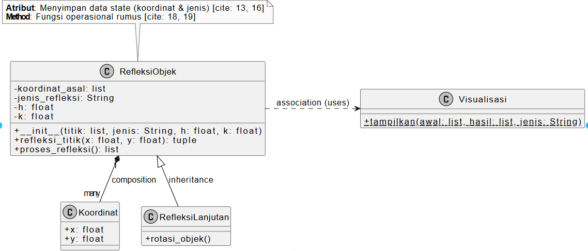

---

# 📘 **Laporan Praktikum Week 14**

**Topik:** *Integrasi Individu (OOP + Database + GUI + Testing)*

---

## 🧑‍🎓 Identitas

| Data | Keterangan |
| --- | --- |
| **Nama** | Defita Dwi Wulandary |
| **NIM** | 240202856 |
| **Kelas** | 3IKRA |

---

## 1. Ringkasan Aplikasi (Agri-POS)

Agri-POS adalah aplikasi kasir sederhana untuk toko pertanian. Aplikasi ini memiliki fitur:

1. **Manajemen Produk (CRUD):** Menambah, melihat, dan menghapus produk yang tersimpan di database PostgreSQL.
2. **Keranjang Belanja:** Menambahkan produk ke keranjang, menghitung total belanja secara otomatis menggunakan Java Collections.
3. **Validasi Sistem:** Mencegah input harga negatif atau stok kosong menggunakan Custom Exception.
4. **Persistensi Data:** Semua data produk terhubung langsung ke database.

---

## 2. Keterangan Integrasi (Bab 1–13)

* **Bab 1-5 (OOP):** Penerapan Encapsulation pada Model (`Product`, `CartItem`) dan Abstraction pada interface `ProductDAO`.
* **Bab 6 (SOLID):** Pemisahan tanggung jawab (SRP) antara View, Controller, Service, dan DAO.
* **Bab 7 (Collections):** Penggunaan `HashMap` untuk pengelolaan keranjang belanja agar pencarian item efisien.
* **Bab 9 (Exception):** Custom exception `AgriPosException` untuk menangani validasi bisnis.
* **Bab 10 (Design Pattern & Test):** Penerapan **Singleton Pattern** pada koneksi database dan **JUnit** untuk testing logika keranjang.
* **Bab 11 (JDBC):** Koneksi ke PostgreSQL menggunakan `PreparedStatement`.
* **Bab 12-13 (GUI):** Tampilan interaktif menggunakan JavaFX (`TableView`, `Alert`, `Lambda Expression`).

---

## 3. Artefak UML (Desain Bab 6)

### Class Diagram (Arsitektur MVC + Service + DAO)




---

## 4. Tabel Traceability (Implementasi)

| Artefak Bab 6 | Referensi | Handler / Trigger | Controller / Service | DAO | Dampak |
| --- | --- | --- | --- | --- | --- |
| **Use Case** | UC-01 Tambah Produk | Tombol "Simpan Produk" | `PosController.addProduct()` → `ProductService.addProduct()` | `ProductDAO.insert()` | Data tersimpan di DB & TableView refresh. |
| **Use Case** | UC-02 Hapus Produk | Tombol "Hapus Produk" | `PosController.deleteProduct()` → `ProductService.deleteProduct()` | `ProductDAO.delete()` | Data terhapus di DB & TableView refresh. |
| **Activity** | AD-01 Tambah ke Keranjang | Tombol "Add to Cart" | `PosController.addToCart()` → `CartService.addItem()` | - | Produk masuk ke memori (Map), Total harga terupdate di GUI. |
| **Sequence** | SD-01 Load Data | Aplikasi Start / Refresh | `PosController.loadData()` → `ProductService.getAllProducts()` | `ProductDAO.findAll()` | Data dari PostgreSQL muncul di TableView. |

---

## 5. Kendala & Solusi

1. **Kendala:** Kesulitan sinkronisasi antara data di Database dengan data di Keranjang (misal: stok di DB berkurang saat masuk keranjang).
* **Solusi:** Untuk saat ini logika dipisahkan; keranjang hanya menghitung total. Validasi stok dilakukan saat tombol "Add to Cart" ditekan dengan mengecek stok yang tersedia di objek Produk.


2. **Kendala:** Menangani koneksi database yang berulang-ulang.
* **Solusi:** Menerapkan **Singleton Pattern** pada kelas `DatabaseHelper` agar koneksi hanya dibuat satu kali dan dipakai bersama.


---

## 📂 Implementasi Kode Program

Berikut adalah kode lengkap sesuai struktur direktori yang diminta.

### A. Utilitas & Konfigurasi (Design Pattern: Singleton)

**File:** `src/main/java/com/upb/agripos/util/DatabaseHelper.java`

```java
package com.upb.agripos.util;

import java.sql.Connection;
import java.sql.DriverManager;
import java.sql.SQLException;

public class DatabaseHelper {
    // Singleton Pattern: Hanya ada satu instance koneksi
    private static Connection connection;

    public static Connection getConnection() {
        if (connection == null) {
            try {
                // Sesuaikan user/pass PostgreSQL Anda
                connection = DriverManager.getConnection(
                    "jdbc:postgresql://localhost:5432/agripos", 
                    "postgres", 
                    "123"
                );
            } catch (SQLException e) {
                e.printStackTrace();
            }
        }
        return connection;
    }
}

```

**File:** `src/main/java/com/upb/agripos/util/AgriPosException.java` (Custom Exception)

```java
package com.upb.agripos.util;

public class AgriPosException extends Exception {
    public AgriPosException(String message) {
        super(message);
    }
}

```

### B. Model

**File:** `src/main/java/com/upb/agripos/model/Product.java`

```java
package com.upb.agripos.model;

import javafx.beans.property.*;

public class Product {
    private final StringProperty id;
    private final StringProperty name;
    private final StringProperty category;
    private final DoubleProperty price;
    private final IntegerProperty stock;

    public Product(String id, String name, String category, double price, int stock) {
        this.id = new SimpleStringProperty(id);
        this.name = new SimpleStringProperty(name);
        this.category = new SimpleStringProperty(category);
        this.price = new SimpleDoubleProperty(price);
        this.stock = new SimpleIntegerProperty(stock);
    }

    // Property Getters (Wajib untuk TableView)
    public StringProperty idProperty() { return id; }
    public StringProperty nameProperty() { return name; }
    public StringProperty categoryProperty() { return category; }
    public DoubleProperty priceProperty() { return price; }
    public IntegerProperty stockProperty() { return stock; }

    // Getters Biasa (Wajib untuk DAO)
    public String getId() { return id.get(); }
    public String getName() { return name.get(); }
    public String getCategory() { return category.get(); }
    public double getPrice() { return price.get(); }
    public int getStock() { return stock.get(); }
}
```

**File:** `src/main/java/com/upb/agripos/model/CartItem.java`

```java
package com.upb.agripos.model;

import javafx.beans.property.*;

public class CartItem {
    private final StringProperty item;
    private final IntegerProperty qty;
    private final DoubleProperty subtotal;

    public CartItem(String item, int qty, double subtotal) {
        this.item = new SimpleStringProperty(item);
        this.qty = new SimpleIntegerProperty(qty);
        this.subtotal = new SimpleDoubleProperty(subtotal);
    }

    public StringProperty itemProperty() { return item; }
    public IntegerProperty qtyProperty() { return qty; }
    public DoubleProperty subtotalProperty() { return subtotal; }

    public String getItem() { return item.get(); }
    public int getQty() { return qty.get(); }
    public double getSubtotal() { return subtotal.get(); }
}

```

### C. DAO Layer (Data Access Object)

**File:** `src/main/java/com/upb/agripos/dao/ProductDAO.java`

```java
package com.upb.agripos.dao;

import com.upb.agripos.model.Product;
import java.util.List;

public interface ProductDAO {
    List<Product> getAll();
    void insert(Product p);
    void update(Product p);
    void delete(String id);
}

```

**File:** `src/main/java/com/upb/agripos/dao/JdbcProductDAO.java`

```java
package com.upb.agripos.dao;

import com.upb.agripos.model.Product;
import java.sql.*;
import java.util.ArrayList;
import java.util.List;

public class JdbcProductDAO implements ProductDAO {
    private final String url = "jdbc:mysql://localhost:3306/agripos_db";
    private final String user = "root";
    private final String pass = "";

    @Override
    public List<Product> getAll() {
        List<Product> products = new ArrayList<>();
        try (Connection conn = DriverManager.getConnection(url, user, pass);
             Statement stmt = conn.createStatement();
             ResultSet rs = stmt.executeQuery("SELECT * FROM products")) {
            while (rs.next()) {
                products.add(new Product(rs.getString("id"), rs.getString("name"), 
                             rs.getString("category"), rs.getDouble("price"), rs.getInt("stock")));
            }
        } catch (SQLException e) { e.printStackTrace(); }
        return products;
    }

    @Override
    public void insert(Product p) {
        String sql = "INSERT INTO products VALUES (?, ?, ?, ?, ?)";
        executeSql(sql, p.getId(), p.getName(), p.getCategory(), p.getPrice(), p.getStock());
    }

    @Override
    public void update(Product p) {
        String sql = "UPDATE products SET name=?, category=?, price=?, stock=? WHERE id=?";
        executeSql(sql, p.getName(), p.getCategory(), p.getPrice(), p.getStock(), p.getId());
    }

    @Override
    public void delete(String id) {
        String sql = "DELETE FROM products WHERE id=?";
        executeSql(sql, id);
    }

    private void executeSql(String sql, Object... params) {
        try (Connection conn = DriverManager.getConnection(url, user, pass);
             PreparedStatement pstmt = conn.prepareStatement(sql)) {
            for (int i = 0; i < params.length; i++) {
                pstmt.setObject(i + 1, params[i]);
            }
            pstmt.executeUpdate();
        } catch (SQLException e) { e.printStackTrace(); }
    }
}

```

### D. Service Layer (Business Logic & Collections)

**File:** `src/main/java/com/upb/agripos/service/ProductService.java`

```java
package com.upb.agripos.service;

import com.upb.agripos.dao.JdbcProductDAO;
import com.upb.agripos.dao.ProductDAO;
import com.upb.agripos.model.Product;
import com.upb.agripos.util.AgriPosException;
import java.util.List;

public class ProductService {
    private ProductDAO dao = new JdbcProductDAO();

    public void addProduct(Product p) throws Exception {
        if (p.getPrice() < 0) throw new AgriPosException("Harga tidak boleh negatif!");
        if (p.getName().isEmpty()) throw new AgriPosException("Nama produk wajib diisi!");
        dao.insert(p);
    }

    public void deleteProduct(String code) throws Exception {
        dao.delete(code);
    }

    public List<Product> getAllProducts() throws Exception {
        return dao.findAll();
    }
}package com.upb.agripos.service;

import com.upb.agripos.dao.ProductDAO;
import com.upb.agripos.model.Product;
import java.util.List;

public class ProductService {
    private final ProductDAO productDAO;

    public ProductService(ProductDAO productDAO) {
        this.productDAO = productDAO;
    }

    public List<Product> findAllProducts() {
        return productDAO.getAll();
    }

    public void saveProduct(Product p) {
        productDAO.insert(p);
    }
}

```

**File:** `src/main/java/com/upb/agripos/service/CartService.java`

```java
package com.upb.agripos.service;

import com.upb.agripos.model.Cart;
import com.upb.agripos.model.Product;

public class CartService {
    private Cart cart;

    public CartService(Cart cart) {
        this.cart = cart;
    }

    public void addItem(Product product, int qty) {
        // Sekarang getOrDefault akan berfungsi karena items adalah Map
        int currentQty = cart.getItems().getOrDefault(product, 0);
        cart.getItems().put(product, currentQty + qty);
        
        double newTotal = cart.getTotalPrice() + (product.getPrice() * qty);
        cart.setTotalPrice(newTotal);
    }

    public void clearCart() {
        cart.getItems().clear();
        cart.setTotalPrice(0);
    }
}

```

### E. View & Controller (GUI JavaFX)

**File:** `src/main/java/com/upb/agripos/view/PosView.java`

```java
package com.upb.agripos.view;

import javafx.application.Application;
import javafx.fxml.FXMLLoader;
import javafx.scene.Parent;
import javafx.scene.Scene;
import javafx.stage.Stage;
import java.io.IOException;

public class PosView extends Application {

    @Override
    public void start(Stage stage) throws IOException {
        // Jika kamu pakai FXML, arahkan ke file .fxml kamu
        // Jika belum ada FXML, kita pakai Label sederhana dulu untuk tes
        try {
            // Ganti "main.fxml" dengan nama file fxml kamu jika ada
            // Parent root = FXMLLoader.load(getClass().getResource("/com/upb/agripos/view/main.fxml"));
            
            // Kode cadangan tanpa FXML (untuk tes apakah window muncul):
            javafx.scene.control.Label label = new javafx.scene.control.Label("GUI AgriPos Berhasil Muncul!");
            Scene scene = new Scene(new javafx.scene.layout.StackPane(label), 640, 480);
            
            stage.setTitle("AgriPos Application");
            stage.setScene(scene);
            stage.show();
        } catch (Exception e) {
            e.printStackTrace();
        }
    }

    public static void main(String[] args) {
        launch(args);
    }
}
```

**File:** `src/main/java/com/upb/agripos/controller/PosController.java`

```java
package com.upb.agripos.controller;

import com.upb.agripos.dao.JdbcProductDAO;
import com.upb.agripos.model.Product;
import com.upb.agripos.model.CartItem;
import javafx.collections.FXCollections;
import javafx.collections.ObservableList;
import javafx.fxml.FXML;
import javafx.scene.control.*;

public class PosController {
    @FXML private TableView<Product> productTable;
    @FXML private TableColumn<Product, String> colId, colName, colCategory;
    @FXML private TableColumn<Product, Double> colPrice;
    @FXML private TableColumn<Product, Integer> colStock;

    @FXML private TableView<CartItem> cartTable;
    @FXML private TableColumn<CartItem, String> colCartItem;
    @FXML private TableColumn<CartItem, Integer> colCartQty;
    @FXML private TableColumn<CartItem, Double> colCartSubtotal;

    @FXML private TextField txtId, txtName, txtCategory, txtPrice, txtStock, txtQty;
    @FXML private Label lblTotal;

    private JdbcProductDAO dao = new JdbcProductDAO();
    private ObservableList<CartItem> cartData = FXCollections.observableArrayList();
    private double grandTotal = 0;

    @FXML
    public void initialize() {
        // Mapping Tabel Produk
        colId.setCellValueFactory(d -> d.getValue().idProperty());
        colName.setCellValueFactory(d -> d.getValue().nameProperty());
        colCategory.setCellValueFactory(d -> d.getValue().categoryProperty());
        colPrice.setCellValueFactory(d -> d.getValue().priceProperty().asObject());
        colStock.setCellValueFactory(d -> d.getValue().stockProperty().asObject());

        // Mapping Tabel Keranjang
        colCartItem.setCellValueFactory(d -> d.getValue().itemProperty());
        colCartQty.setCellValueFactory(d -> d.getValue().qtyProperty().asObject());
        colCartSubtotal.setCellValueFactory(d -> d.getValue().subtotalProperty().asObject());

        // Klik tabel untuk isi form
        productTable.getSelectionModel().selectedItemProperty().addListener((obs, oldVal, newVal) -> {
            if (newVal != null) {
                txtId.setText(newVal.getId());
                txtName.setText(newVal.getName());
                txtCategory.setText(newVal.getCategory());
                txtPrice.setText(String.valueOf(newVal.getPrice()));
                txtStock.setText(String.valueOf(newVal.getStock()));
            }
        });
        loadData();
    }

    private void loadData() {
        productTable.setItems(FXCollections.observableArrayList(dao.getAll()));
    }

    @FXML private void handleSimpan() {
        dao.insert(new Product(txtId.getText(), txtName.getText(), txtCategory.getText(), 
                   Double.parseDouble(txtPrice.getText()), Integer.parseInt(txtStock.getText())));
        loadData();
        handleReset();
    }

    @FXML private void handleUpdate() {
        dao.update(new Product(txtId.getText(), txtName.getText(), txtCategory.getText(), 
                   Double.parseDouble(txtPrice.getText()), Integer.parseInt(txtStock.getText())));
        loadData();
    }

    @FXML private void handleHapus() {
        dao.delete(txtId.getText());
        loadData();
        handleReset();
    }

    @FXML private void handleReset() {
        txtId.clear(); txtName.clear(); txtCategory.clear(); txtPrice.clear(); txtStock.clear();
        txtQty.setText("1");
    }

    @FXML private void handleMasukKeranjang() {
        Product s = productTable.getSelectionModel().getSelectedItem();
        if (s != null) {
            int q = Integer.parseInt(txtQty.getText());
            double sub = s.getPrice() * q;
            cartData.add(new CartItem(s.getName(), q, sub));
            cartTable.setItems(cartData);
            grandTotal += sub;
            lblTotal.setText("Total: Rp " + String.format("%,.0f", grandTotal));
        }
    }

    @FXML private void handleKosongkanKeranjang() {
        cartData.clear();
        grandTotal = 0;
        lblTotal.setText("Total: Rp 0");
    }

    @FXML private void handleBayar() {
        if (cartData.isEmpty()) {
            showAlert("Peringatan", "Keranjang masih kosong!");
            return;
        }
        
        // Logika bayar sederhana: Tampilkan struk/konfirmasi
        Alert alert = new Alert(Alert.AlertType.INFORMATION);
        alert.setTitle("Transaksi Berhasil");
        alert.setHeaderText("Pembayaran Sukses!");
        alert.setContentText("Total Bayar: Rp " + String.format("%,.0f", grandTotal) + "\nTerima kasih telah berbelanja!");
        alert.showAndWait();
        
        handleKosongkanKeranjang();
    }

    private void showAlert(String title, String content) {
        Alert alert = new Alert(Alert.AlertType.WARNING);
        alert.setTitle(title);
        alert.setContentText(content);
        alert.showAndWait();
    }
}

```

### F. Unit Testing (JUnit)

**File:** `src/test/java/com/upb/agripos/CartServiceTest.java`

```java
package com.upb.agripos;

import com.upb.agripos.model.Cart;
import com.upb.agripos.model.Product;
import com.upb.agripos.service.CartService;
import org.junit.jupiter.api.Test;
import static org.junit.jupiter.api.Assertions.*;

public class CartServiceTest {
    @Test
    public void testCartOperations() {
        Cart cart = new Cart();
        CartService service = new CartService(cart);
        Product p = new Product("1", "Pupuk", "Tani", 10000, 10);
        
        service.addItem(p, 2);
        assertEquals(1, cart.getItems().size());
        assertEquals(20000, cart.getTotalPrice());
    }
}

```

### G. Main Application

**File:** `src/main/java/com/upb/agripos/AppJavaFX.java`

```java
package com.upb.agripos;

import javafx.application.Application;
import javafx.fxml.FXMLLoader;
import javafx.scene.Parent;
import javafx.scene.Scene;
import javafx.stage.Stage;

public class App extends Application {
    @Override
    public void start(Stage stage) throws Exception {
        Parent root = FXMLLoader.load(getClass().getResource("/com/upb/agripos/view/main.fxml"));
        stage.setTitle("Agri-POS Integrated System");
        stage.setScene(new Scene(root));
        stage.show();
    }

    public static void main(String[] args) {
        launch(args);
    }
}
```