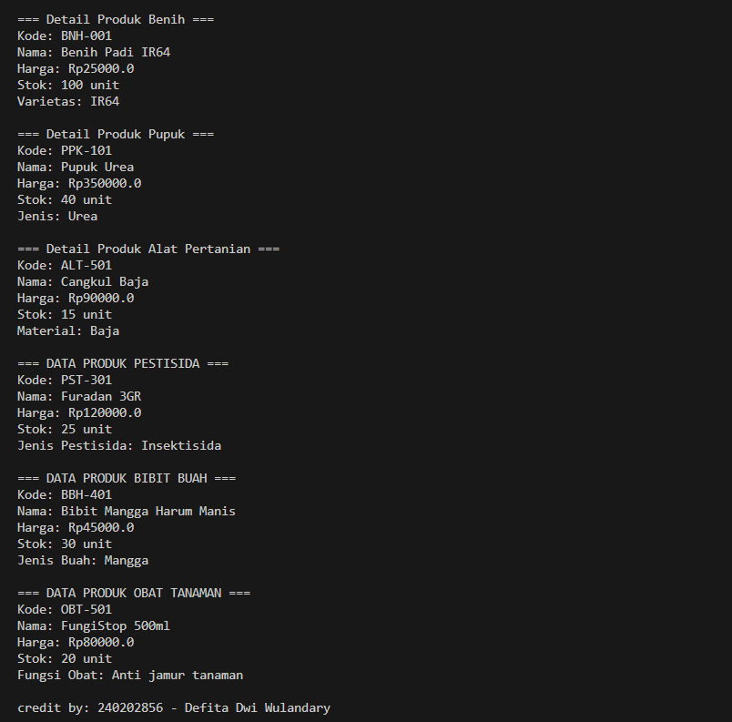

# Laporan Praktikum Minggu 3
Topik: Inheritance (Kategori Produk)
## Identitas
- Nama       : Defita Dwi Wulandary
- NIM        : 240202856
- Kelas      : 3IKRA

---

## Tujuan
1. Menjelaskan konsep inheritance dalam OOP.
2. Membuat superclass dan subclass produk pertanian.
3. Mendemonstrasikan hierarki class melalui kode.
4. Menggunakan super untuk memanggil konstruktor dan method parent.
5. Menyusun laporan tentang perbedaan inheritance vs class tunggal.
---

## Dasar Teori
3. Superclass: class induk yang mendefinisikan atribut umum.
2. Subclass: class turunan yang mewarisi atribut/method superclass, dan dapat menambahkan atribut/method baru.
3. Super digunakan untuk memanggil konstruktor atau method superclass.---

## Langkah Praktikum
1. **Membuat Superclass Produk**  
   - Gunakan class `Produk` dari Bab 2 sebagai superclass.  

2. **Membuat Subclass**  
   - `Benih.java` → atribut tambahan: varietas.  
   - `Pupuk.java` → atribut tambahan: jenis pupuk (Urea, NPK, dll).  
   - `AlatPertanian.java` → atribut tambahan: material (baja, kayu, plastik).  

3. **Membuat Main Class**  
   - Instansiasi minimal satu objek dari tiap subclass.  
   - Tampilkan data produk dengan memanfaatkan inheritance.  

4. **Menambahkan CreditBy**  
   - Panggil class `CreditBy` untuk menampilkan identitas mahasiswa.  

5. **Commit dan Push**  
   - Commit dengan pesan: `week3-inheritance`.  
---

## Kode Program
super class
```java
// Contoh produk

package com.upb.agripos.model;

public class Produk {
    private String kode;
    private String nama;
    private double harga;
    private int stok;

    public Produk(String kode, String nama, double harga, int stok) {
        this.kode = kode;
        this.nama = nama;
        this.harga = harga;
        this.stok = stok;
    }

    // Getter & Setter
    public String getKode() { return kode; }
    public void setKode(String kode) { this.kode = kode; }

    public String getNama() { return nama; }
    public void setNama(String nama) { this.nama = nama; }

    public double getHarga() { return harga; }
    public void setHarga(double harga) { this.harga = harga; }

    public int getStok() { return stok; }
    public void setStok(int stok) { this.stok = stok; }

    // Method umum
    public void tampilkanInfo() {
        System.out.println("Kode: " + kode);
        System.out.println("Nama: " + nama);
        System.out.println("Harga: Rp" + harga);
        System.out.println("Stok: " + stok + " unit");
    }
}

```
sub clas
```
// contoh pupuk

package com.upb.agripos.model;

public class pupuk extends Produk {
    private String jenis;

    public pupuk(String kode, String nama, double harga, int stok, String jenis) {
        super(kode, nama, harga, stok);
        this.jenis = jenis;
    }

    public String getJenis() { return jenis; }
    public void setJenis(String jenis) { this.jenis = jenis; }

    // Method tambahan
    public void deskripsi() {
        System.out.println("\n=== Detail Produk Pupuk ===");
        tampilkanInfo();
        System.out.println("Jenis: " + jenis);
    }
}

```
```// contoh main

package com.upb.agripos;

import com.upb.agripos.model.alatpertanian;
import com.upb.agripos.model.benih;
import com.upb.agripos.model.bibitbuah;
import com.upb.agripos.model.obatTanaman;
import com.upb.agripos.model.pestisida;
import com.upb.agripos.model.pupuk;
import com.upb.agripos.util.CreditBy;

public class MainInheritance {
    public static void main(String[] args) {
        // Membuat objek dari tiap subclass
        benih benih = new benih("BNH-001", "Benih Padi IR64", 25000, 100, "IR64");
        pupuk pupuk = new pupuk ("PPK-101", "Pupuk Urea", 350000, 40, "Urea");
        alatpertanian alat = new alatpertanian ("ALT-501", "Cangkul Baja", 90000, 15, "Baja");
        pestisida pestisida = new pestisida("PST-301", "Furadan 3GR", 120000, 25, "Insektisida");
        bibitbuah bibitBuah = new bibitbuah("BBH-401", "Bibit Mangga Harum Manis", 45000, 30, "Mangga");
        obatTanaman obat = new obatTanaman("OBT-501", "FungiStop 500ml", 80000, 20, "Anti jamur tanaman");

        benih.deskripsi();
        pupuk.deskripsi();
        alat.deskripsi();
        pestisida.deskripsi();
        bibitBuah.deskripsi();
        obat.deskripsi();   
        // Identitas pengembang
        CreditBy.print("240202856", "Defita Dwi Wulandary");
    }
}

```

---

## Hasil Eksekusi



---

## Analisis
1. Class Produk berperan sebagai superclass yang menyimpan atribut umum: kode, nama, harga, dan stok.
2. Class Benih, Pupuk, dan AlatPertanian adalah subclass yang mewarisi semua atribut dan method dari Produk.
3. Masing-masing subclass menambahkan atribut khusus seperti varietas, jenis, dan bahan.
4. Konstruktor subclass menggunakan super() untuk memanggil konstruktor induk.
5. Method tampilkanInfo() dipanggil dari superclass tanpa perlu ditulis ulang.
6. Method deskripsi() di tiap subclass menampilkan data lengkap produk sesuai jenisnya.
7. Objek dibuat di MainInheritance dan menampilkan informasi secara hierarkis.
---

## Kesimpulan
program ini yang menerapkan Inheritance, dengan class Benih, Pupuk, dan AlatPertanian yang mewarisi atribut dan method dari class Produk, membuat kode menjadi lebih efisien, terstruktur, dan mudah dikembangkan.

---

## Checklist Keberhasilan

* [x] Superclass `produk` digunakan kembali tanpa duplikasi kode.
* [x] Subclass `benih`, `pupuk`, dan `alatpertanian` berhasil dibuat dengan atribut tambahan.
* [x] Program berjalan menampilkan objek dari setiap subclass.
* [x] `CreditBy` ditampilkan dengan benar.
* [x] Commit sesuai instruksi.
* [x] Laporan singkat lengkap dengan analisis.

---

## Quiz

1. **Apa keuntungan menggunakan inheritance dibanding membuat class terpisah tanpa hubungan?**
   **Jawaban:** Menggunakan inheritance lebih menguntungkan karena dapat menghindari duplikasi kode, memudahkan pemeliharaan, membuat struktur program lebih teratur, mendukung polimorfisme, dan mempermudah pengembangan class baru tanpa mengubah kode yang sudah ada.

2. **Bagaimana cara subclass memanggil konstruktor superclass?**
   **Jawaban:** Subclass memanggil konstruktor superclass dengan menulis 'super(...)' di baris pertama konstruktor untuk mewarisi dan menginisialisasi data dari superclass.

3. **Berikan contoh kasus di POS pertanian selain Benih, Pupuk, dan Alat Pertanian yang bisa dijadikan subclass.**
   **Jawaban:** Contoh kasus lain di POS pertanian yang bisa dijadikan subclass yaitu Pestisida.
Subclass ini dapat mewarisi atribut dari Produk seperti kode, nama, harga, dan stok, lalu menambahkan atribut khusus seperti jenisHama atau dosisPemakaian.
