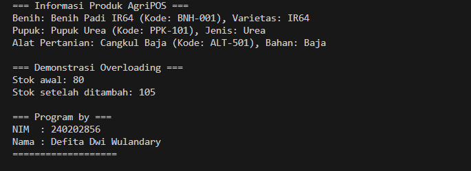

# Laporan Praktikum Minggu 4
Topik: Polymorphism

## Identitas
- Nama  : Defita Dwi Wulandary
- NIM   : 240202856
- Kelas : 3IKRA

---

## Tujuan
- Mahasiswa memahami dan menerapkan konsep polymorphism dalam OOP.
- Mahasiswa dapat membedakan antara overloading dan overriding.
- Mahasiswa dapat mengimplementasikan dynamic binding pada sistem nyata (studi kasus AgriPOS).
- Mahasiswa dapat membuat program dengan struktur class yang efisien dan modular.

---

## Dasar Teori
Polymorphism berarti banyak bentuk.
Konsep ini memungkinkan objek-objek dari subclass yang berbeda untuk merespons method yang sama secara berbeda sesuai jenisnya.
1. Class adalah blueprint dari objek.  
2. Object adalah instansiasi dari class.  
3. Enkapsulasi digunakan untuk menyembunyikan data.

---

## Langkah Praktikum
(Tuliskan Langkah-langkah dalam prakrikum, contoh:
1. Langkah-langkah yang dilakukan (setup, coding, run).  
2. File/kode yang dibuat.  
3. Commit message yang digunakan.)

---

## Kode Program


```Produk
package main.java.com.upb.agripos.model;

public class Produk {
    private String kode;
    private String nama;
    private double harga;
    private int stok;

    public Produk(String kode, String nama, double harga, int stok) {
        this.kode = kode;
        this.nama = nama;
        this.harga = harga;
        this.stok = stok;
    }

    public void tambahStok(int jumlah) {
        this.stok += jumlah;
    }

    public void tambahStok(double jumlah) {
        this.stok += (int) jumlah;
    }

    // Tambahkan getter di bawah ini
    public String getKode() {
        return kode;
    }

    public String getNama() {
        return nama;
    }

    public double getHarga() {
        return harga;
    }

    public int getStok() {
        return stok;
    }

    public String getInfo() {
        return "Produk: " + nama + " (Kode: " + kode + ")";
    }
}

```Benih
package main.java.com.upb.agripos.model;

public class Benih extends Produk {
    private String varietas;

    public Benih(String kode, String nama, double harga, int stok, String varietas) {
        super(kode, nama, harga, stok);
        this.varietas = varietas;
    }

    @Override
    public String getInfo() {
        return "Benih: " + getNama() + " (Kode: " + getKode() + "), Varietas: " + varietas;
    }
}

```Pupuk
package main.java.com.upb.agripos.model;

public class Pupuk extends Produk {
    private String jenis;

    public Pupuk(String kode, String nama, double harga, int stok, String jenis) {
        super(kode, nama, harga, stok);
        this.jenis = jenis;
    }

    @Override
    public String getInfo() {
        return "Pupuk: " + getNama() + " (Kode: " + getKode() + "), Jenis: " + jenis;
    }
}

```CreditBy
package main.java.com.upb.agripos.util;

public class CreditBy {
    public static void print(String nim, String nama) {
        System.out.println("\n=== Program by ===");
        System.out.println("NIM  : " + nim);
        System.out.println("Nama : " + nama);
        System.out.println("===================");
    }
}

```MainPolymorphism
package main.java.com.upb.agripos;

import main.java.com.upb.agripos.model.*;
import main.java.com.upb.agripos.util.CreditBy;

public class MainPolymorphism {
    public static void main(String[] args) {

        // Membuat array berisi berbagai jenis produk (Polymorphism)
        Produk[] daftarProduk = {
            new Benih("BNH-001", "Benih Padi IR64", 25000, 100, "IR64"),
            new Pupuk("PPK-101", "Pupuk Urea", 350000, 50, "Urea"),
            new AlatPertanian("ALT-501", "Cangkul Baja", 90000, 15, "Baja")
        };

        // Demonstrasi Dynamic Binding (pemanggilan method getInfo() berbeda-beda)
        System.out.println("=== Informasi Produk AgriPOS ===");
        for (Produk p : daftarProduk) {
            System.out.println(p.getInfo());
        }

        // Demonstrasi Overloading
        System.out.println("\n=== Demonstrasi Overloading ===");
        Benih benih = new Benih("BNH-002", "Benih Jagung Bisi", 20000, 80, "Bisi 2");
        System.out.println("Stok awal: " + benih.getStok());
        benih.tambahStok(20);   // versi int
        benih.tambahStok(5.5);  // versi double
        System.out.println("Stok setelah ditambah: " + benih.getStok());

        // Identitas Mahasiswa
        CreditBy.print("240202856", "Defita Dwi Wulandary");
    }
}

```
---

## Hasil Eksekusi
(Sertakan screenshot hasil eksekusi program.  

)
---

## Analisis
(
- Overloading terjadi pada method tambahStok() di class Produk, yang memiliki dua versi parameter (int dan double).
- Overriding terjadi di setiap subclass (Benih, Pupuk, AlatPertanian) pada method getInfo().
- Dynamic Binding terjadi saat array Produk[] daftarProduk menampung berbagai objek dan Java otomatis memanggil getInfo() sesuai jenis objek aktual.
- Program berjalan dengan baik tanpa error, menunjukkan konsep polymorphism diterapkan dengan benar. 
)
---

## Kesimpulan  
- Polymorphism memudahkan pengelolaan objek yang berbeda dalam satu struktur umum.
- Dengan overriding dan dynamic binding, program menjadi fleksibel dan mudah dikembangkan.
- Konsep ini penting untuk pembuatan sistem yang modular seperti AgriPOS.

---

## Quiz
1. Apa perbedaan overloading dan overriding?
   **Jawaban:** Overloading terjadi ketika dua atau lebih method memiliki nama yang sama tetapi parameter berbeda dalam satu class.
Sedangkan overriding terjadi ketika subclass mengganti implementasi method yang sudah ada di superclass dengan isi yang berbeda.

2. Bagaimana Java menentukan method mana yang dipanggil dalam dynamic binding?
   **Jawaban:**Java menentukan method yang dipanggil berdasarkan tipe objek aktual saat runtime, bukan berdasarkan tipe referensinya.
Artinya, meskipun objek disimpan dalam variabel bertipe superclass, method yang dijalankan tetap berasal dari subclass yang sebenarnya.

3. Berikan contoh kasus polymorphism dalam sistem POS selain produk pertanian
   **Jawaban:**Contohnya pada sistem POS restoran:
Superclass MenuItem memiliki method getInfo().
Subclass-nya seperti Makanan, Minuman, dan PaketCombo masing-masing mengoverride method getInfo() untuk menampilkan detail berbeda sesuai jenis menu.
