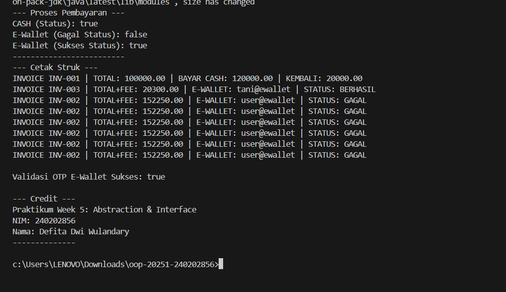

# Laporan Praktikum Minggu 5
Topik: Abstraction (Abstract Class & Interface)

## Identitas
- Nama  : Defita Dwi WUlandary
- NIM   : 240204856
- Kelas : 3IKRA

---

## Tujuan
- Menjelaskan perbedaan antara abstract class dan interface dalam Java.
- Mendesain dan mengimplementasikan abstract class beserta method abstrak-nya sesuai kebutuhan kasus.
- Membuat interface dan mengimplementasikannya pada class terkait.
- Menerapkan konsep multiple inheritance melalui interface.
- Mempresentasikan hasil rancangan dalam program AgriPOS yang menampilkan struk pembayaran.

---

## Dasar Teori
1. Abstraksi: Proses menyederhanakan kompleksitas dengan menampilkan elemen penting dan menyembunyikan detail implementasi.
2. Abstract Class: Tidak dapat diinstansiasi, dapat memiliki method abstrak (tanpa badan) dan non-abstrak, serta dapat menyimpan state (field).
3. Interface: Kumpulan kontrak (method tanpa implementasi konkret). Mendukung multiple inheritance (class dapat mengimplementasikan banyak interface).
4. Multiple Inheritance via Interface: Memungkinkan sebuah class mewarisi perilaku (kontrak) dari dua atau lebih sumber, yang lebih aman di Java daripada mewarisi state dari banyak class.

---

## Langkah Praktikum
1. Abstract Class: Membuat Pembayaran.java (abstract) dengan method abstrak (biaya(), prosesPembayaran()) dan method konkrit (totalBayar()).
2. Subclass Konkret: Membuat Cash.java dan EWallet.java yang mewarisi Pembayaran dan mengimplementasikan semua method abstrak.
3. Interface: Membuat Validatable.java dan Receiptable.java (kontrak).
4. Multiple Inheritance: Menerapkan EWallet agar mengimplementasikan dua interface (Validatable, Receiptable), dan Cash mengimplementasikan Receiptable.
Commit Message: week5-abstraction-interface

---

## Kode Program

// 1. `Pembayaran.java` (Abstract Class)

package main.java.com.upb.agripos.model.pembayaran;
public abstract class Pembayaran {
    protected String invoiceNo;
    protected double total;

    public Pembayaran(String invoiceNo, double total) {
        this.invoiceNo = invoiceNo;
        this.total = total;
    }

    public abstract double biaya();              // biaya tambahan
    public abstract boolean prosesPembayaran();  // hasil: berhasil/gagal

    public double totalBayar() {
        return total + biaya();
    }

    public String getInvoiceNo() {
        return invoiceNo;
    }

    public double getTotal() {
        return total;
    }
}

// 2. `Validatable.java`
 package com.upb.agripos.model.kontrak;

 public interface Validatable {
    boolean validasi();
 }

// 3. `Receiptable.java`
 package com.upb.agripos.model.kontrak;

 public interface Receiptable {
    String cetakStruk();
    
 }

4. // `Cash.java`

package main.java.com.upb.agripos.model.pembayaran;

import main.java.com.upb.agripos.model.kontrak.Receiptable;

public class Cash extends Pembayaran implements Receiptable {
    private double tunai;

    public Cash(String invoiceNo, double total, double tunai) {
        super(invoiceNo, total);
        this.tunai = tunai;
    }

    @Override
    public double biaya() {
        return 0.0;
    }

    @Override
    public boolean prosesPembayaran() {
        return tunai >= totalBayar(); // sederhana: cukup uang tunai
    }

    @Override
    public String cetakStruk() {
        return String.format("INVOICE %s | TOTAL: %.2f | BAYAR CASH: %.2f | KEMBALI: %.2f",
                invoiceNo, totalBayar(), tunai, Math.max(0, tunai - totalBayar()));
    }
}

5. // `EWallet.java`

package main.java.com.upb.agripos.model.pembayaran;

import main.java.com.upb.agripos.model.kontrak.Validatable;
import main.java.com.upb.agripos.model.kontrak.Receiptable;

public class EWallet extends Pembayaran implements Validatable, Receiptable {
    private String akun;
    private String otp;

    public EWallet(String invoiceNo, double total, String akun, String otp) {
        super(invoiceNo, total);
        this.akun = akun;
        this.otp = otp;
    }

    @Override
    public double biaya() {
        return total * 0.015; // biaya 1.5%
    }

    @Override
    public boolean validasi() {
        return otp != null && otp.length() == 6; // OTP valid jika panjangnya 6
    }

    @Override
    public boolean prosesPembayaran() {
        return validasi(); // proses pembayaran hanya jika validasi berhasil
    }

    @Override
    public String cetakStruk() {
        return String.format(
            "INVOICE %s | TOTAL+FEE: %.2f | E-WALLET: %s | STATUS: %s",
            invoiceNo, totalBayar(), akun,
            prosesPembayaran() ? "BERHASIL" : "GAGAL"
        );
    }
}
 
6. // `CreditBy.java`

package main.java.com.upb.agripos.util;

public class CreditBy {
    public static void print(String nim, String nama) {
        System.out.println("\n--- Credit ---");
        System.out.println("Praktikum Week 5: Abstraction & Interface");
        System.out.println("NIM: " + nim);
        System.out.println("Nama: " + nama);
        System.out.println("--------------");
    }
}

7. // `MainAbstraction`

package main.java.com.upb.agripos;

import main.java.com.upb.agripos.model.pembayaran.*;
import main.java.com.upb.agripos.model.kontrak.*;
import main.java.com.upb.agripos.util.CreditBy;

public class MainAbstraction {
    public static void main(String[] args) {
        // Kasus 1: Pembayaran Tunai (Cash) - Uang Cukup
        Pembayaran cashOK = new Cash("INV-001", 100000, 120000);
        
        // Kasus 2: Pembayaran E-Wallet - Validasi Gagal (OTP kurang dari 6 digit)
        Pembayaran ewGagal = new EWallet("INV-002", 150000, "user@ewallet", "123");
        
        // Kasus 3: Pembayaran E-Wallet - Validasi Berhasil
        Pembayaran ewSukses = new EWallet("INV-003", 20000, "tani@ewallet", "123456");
        
        // DEMO 1: Proses Pembayaran
        System.out.println("--- Proses Pembayaran ---");
        System.out.println("CASH (Status): " + cashOK.prosesPembayaran());
        System.out.println("E-Wallet (Gagal Status): " + ewGagal.prosesPembayaran());
        System.out.println("E-Wallet (Sukses Status): " + ewSukses.prosesPembayaran());
        System.out.println("-------------------------");
        
        // DEMO 2: Dynamic Binding melalui Interface (Receiptable)
        System.out.println("--- Cetak Struk ---");
        
        // Casting diperlukan karena cashOK dan ewSukses bertipe Pembayaran
        // dan kita ingin memanggil method dari interface Receiptable
        System.out.println(((Receiptable) cashOK).cetakStruk());
        System.out.println(((Receiptable) ewSukses).cetakStruk());
        System.out.println(((Receiptable) ewGagal).cetakStruk());

        // DEMO 3: Menggunakan Validatable (khusus EWallet)
        if (ewSukses instanceof Validatable) {
            Validatable v = (Validatable) ewSukses;
            System.out.println("\nValidasi OTP E-Wallet Sukses: " + v.validasi());
        }

        CreditBy.print("240202856", "Defita Dwi Wulandary");
    }
}

---

## Hasil Eksekusi

---

## Analisis
- Jelaskan bagaimana kode berjalan. Kode mendemonstrasikan Abstraksi dan Polymorphism. Abstract Class Pembayaran mendefinisikan kontrak umum (biaya(), prosesPembayaran()) yang harus dipenuhi oleh class konkret (Cash, EWallet). Method konkrit totalBayar() menggunakan method abstrak biaya(). Pemanggilan cetakStruk() pada objek cash dan ew menunjukkan dynamic binding melalui interface Receiptable, di mana implementasi method berbeda sesuai class konkretnya.

- Apa perbedaan pendekatan minggu ini dibanding minggu sebelumnya. Minggu Lalu (Polymorphism/Inheritance) berfokus pada implementasi dan hierarki state. Minggu Ini (Abstraction & Interface) berfokus pada kontrak desain. Abstraksi memungkinkan kita mendesain Pembayaran tanpa tahu detailnya, dan interface memungkinkan EWallet memiliki kemampuan ganda (Validatable dan Receiptable) yang tidak dapat dilakukan melalui single inheritance class.

- Kendala yang dihadapi dan cara mengatasinya (Kendala Buatan).
  - Kendala: Awalnya terjadi compile error karena lupa mengimplementasikan semua method abstrak (biaya() dan prosesPembayaran()) di class konkret (Cash.java).
  - Cara Mengatasi: Memastikan setiap class yang mewarisi Abstract Class (Pembayaran) atau mengimplementasikan Interface (Receiptable) harus menyediakan badan method (implementasi) untuk semua method abstrak/interface yang ada.
---

## Kesimpulan
Praktikum Minggu 5 berhasil menerapkan Abstraksi dan Interface. Pembayaran sebagai Abstract Class berhasil menyimpan state dasar dan logic umum (totalBayar()), sementara Interface (Receiptable, Validatable) berhasil mendefinisikan kemampuan yang dapat diimplementasikan oleh banyak class berbeda (EWallet dan Cash), sekaligus mendemonstrasikan Multiple Inheritance via Interface.

---

## Quiz
1. Jelaskan perbedaan konsep dan penggunaan abstract class dan interface. 
   
   **Jawaban:** Abstract class digunakan ketika beberapa kelas memiliki struktur dan perilaku dasar yang sama. Abstract class dapat berisi field (state) dan method dengan atau tanpa implementasi.
Sedangkan interface hanya berisi deklarasi method (kontrak perilaku) tanpa state, dan dipakai untuk mendefinisikan kemampuan tambahan yang bisa dimiliki berbagai kelas yang tidak berhubungan langsung dalam hierarki.

2. Mengapa multiple inheritance lebih aman dilakukan dengan interface pada Java?
   
   **Jawaban:** Karena interface tidak membawa data atau implementasi konkret, hanya definisi method. Dengan demikian, satu kelas bisa mengimplementasikan banyak interface tanpa risiko konflik pewarisan (diamond problem) seperti yang terjadi bila mewarisi lebih dari satu class.

3. Pada contoh Agri-POS, bagian mana yang paling tepat menjadi abstract class dan mana yang menjadi interface? Jelaskan alasannya.
   
   **Jawaban:** Kelas Pembayaran tepat dijadikan abstract class karena memiliki atribut dan logika umum seperti invoiceNo, total, serta method totalBayar().
Sedangkan Validatable dan Receiptable lebih sesuai sebagai interface karena hanya berisi kontrak perilaku tambahan (misalnya validasi OTP dan cetak struk) yang tidak wajib dimiliki semua jenis pembayaran.
