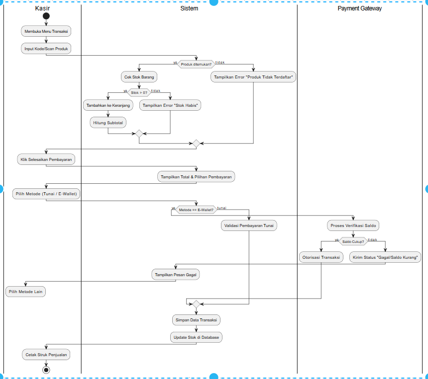

# Laporan Praktikum Week 6 – Desain Arsitektur Sistem Agri-POS Menggunakan UML & SOLID

## Identitas
- **Nama:** Defita Dwi Wulandary  
- **NIM:** 240202856  
- **Kelas:** 3 IKRA

---

## Tujuan
Praktikum ini bertujuan untuk:
1. Mahasiswa mampu memetakan kebutuhan sistem menjadi diagram UML.
2. Mahasiswa mampu membuat Use Case, Activity, Sequence, dan Class Diagram.
3. Mahasiswa memahami dan menerapkan prinsip desain SOLID.
4. Mahasiswa mampu menghubungkan kebutuhan fungsional ke desain arsitektur perangkat lunak.

---

## Dasar Teori

### 1. UML (Unified Modeling Language)
UML adalah standar pemodelan yang digunakan untuk menggambarkan desain sistem perangkat lunak.  
Dalam praktikum ini digunakan 4 diagram:
- **Use Case Diagram**
- **Activity Diagram**
- **Sequence Diagram**
- **Class Diagram**

### 2. Prinsip SOLID
1. **S — Single Responsibility Principle**  
   Setiap class hanya memiliki satu alasan untuk berubah.
2. **O — Open/Closed Principle**  
   Kelas terbuka untuk ekstensi, tertutup untuk modifikasi.
3. **L — Liskov Substitution Principle**  
   Subclass harus dapat menggantikan superclass tanpa mengubah perilaku.
4. **I — Interface Segregation Principle**  
   Interface harus spesifik, tidak terlalu gemuk.
5. **D — Dependency Inversion Principle**  
   High-level module harus bergantung pada abstraksi.

---

## Deskripsi Sistem Agri-POS
Agri-POS adalah sistem Point of Sales untuk produk pertanian yang mendukung:
- Manajemen produk (tambah, ubah, hapus, lihat)
- Transaksi dan checkout
- Pembayaran tunai & e-wallet
- Cetak struk
- Laporan penjualan harian/periodik
- Login dan hak akses (admin & kasir)

---

## Dokumentasi Diagram UML

### 1. Use Case Diagram

### 2. Activity Diagram (Checkout)

### 3. Sequence Diagram Pembayaran
![Sequence Diagram]

### 4. Class Diagram

---

## Langkah Praktikum
1. Menganalisis kebutuhan sistem dari deskripsi awal.  
2. Membuat daftar aktor dan use case.  
3. Menggambar Use Case Diagram sebagai iterasi pertama.  
4. Mendesain Activity Diagram proses checkout lengkap dengan skenario gagal.  
5. Membuat Sequence Diagram untuk pembayaran tunai dan e-wallet.  
6. Mendesain Class Diagram berdasarkan relasi antar objek dan prinsip SOLID.  
7. Menghasilkan file diagram `.png` dan dokumentasinya.  
8. Menyusun laporan dalam format markdown.

---

## Contoh Kode Implementasi Prinsip SOLID 

---

## Analisis
- Desain UML menunjukkan alur sistem secara lengkap dari perspektif fungsional dan struktural.  
- Prinsip SOLID diterapkan menggunakan interface (`PaymentMethod`, `ProductRepository`) sehingga sistem mudah diperluas.  
- Activity dan Sequence Diagram menggambarkan skenario sukses dan gagal.  
- Class Diagram sudah modular dan memenuhi prinsip SRP & DIP.  

---

## Traceability Matrix

| FR | Use Case | Activity | Sequence | Class |
|----|----------|----------|----------|--------|
| Manajemen Produk | ✔ | – | – | ProductService, ProductRepository |
| Pembayaran | ✔ | ✔ | ✔ | PaymentService, PaymentMethod, CashPayment, EWalletPayment |
| Checkout | ✔ | ✔ | ✔ | Cart, Transaction |
| Cetak Struk | ✔ | ✔ | ✔ | ReceiptPrinter |
| Laporan Penjualan | ✔ | – | – | ReportService |

---

## Kesimpulan
Melalui praktikum ini, mahasiswa dapat memahami bagaimana menghubungkan kebutuhan sistem ke desain arsitektur menggunakan UML dan prinsip SOLID. Sistem menjadi modular, mudah dikembangkan, serta lebih maintainable.

---

## Quiz & Jawaban

1. **Perbedaan aggregation dan composition?**  
   **Jawaban:** Aggregation adalah relasi longgar dimana objek dapat berdiri sendiri.  
   Composition adalah relasi kuat dimana objek tidak dapat hidup tanpa objek induknya.

2. **Bagaimana prinsip Open/Closed membantu pengembangan sistem?**  
   **Jawaban:** OCP memastikan kelas dapat ditambah fitur baru tanpa perlu mengubah kode lama sehingga lebih aman dan stabil.

3. **Mengapa Dependency Inversion Principle meningkatkan testability?**  
   **Jawaban:** Karena dependensi berbasis interface dapat diganti mock ketika testing, sehingga proses pengujian lebih mudah dan modular.